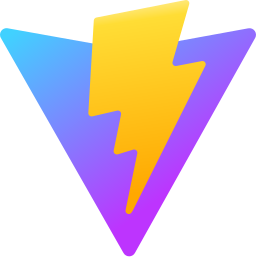

# Hi there!

My name's Eli, and I'm a 15 year old developer from Canada!

I'm currently working on building a 2D game engine so that I can eventually get around to making some sellable indie games, as well as developing several applications for my church.

I'm also learning tons of new things, such as physics, networking, the rendering pipeline, data compression, web design, socializing, and much more.  I'm hoping to get better at binary operations, vectors and linear algebra, fragment shaders, and calculus.

I used to work for a small incorporation called _Cracklecat Inc_. where I got to work on several sites owned by _Advice On Wealth_, as well as the _Moo To Do_ app by _CATTLEytics_.

Fun fact: The number of buttons on the NES controller was no coincidence.  You see, there are 8 buttons (up, down, left, right, a, b, start, select), each with two possible states (on, off).  That's exactly the same as a byte, which has 8 bits that can be either a "1" or a "0".  This means that the state of the controller can be expressed using only a single byte, therefore optimizing the how much space the controller state takes up.

## Other accounts

  
  
  

## Languages/frameworks

  
  
  
  
  
  
  
  
  
  
  
  
  
  
  

<!--
- 🔭 I’m currently working on ...
- 🌱 I’m currently learning ...
- 👯 I’m looking to collaborate on ...
- 🤔 I’m looking for help with ...
- 💬 Ask me about ...
- 📫 How to reach me: ...
- 😄 Pronouns: ...
- ⚡ Fun fact: ...
-->
